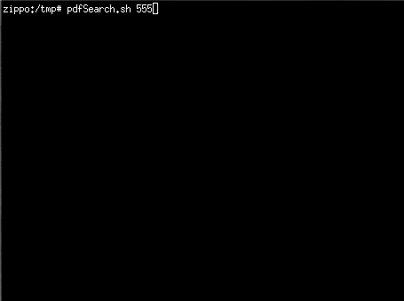
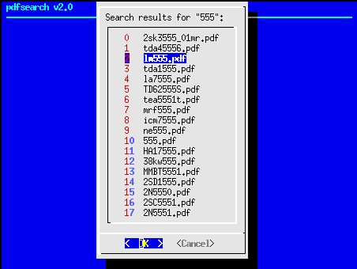

# pdfsearch
command line pdf repository search tool for linux.

This allows for a search of datasheets in a file library(s)

Use: pdfSearch.sh lm555     for it to immediatly search for that term, if there are multiple results, it will list them for you to select from.

Use: pdfSearch.sh        and it will ask for the search term, and give you a list of options. *but* when your done, it will go back to asking for another term.

There is a variable in the script that needs to be pointed at the space-seperated list of base directories for it to search for your pdf

I have this set to: store=/morfiles/doc/pdf/

